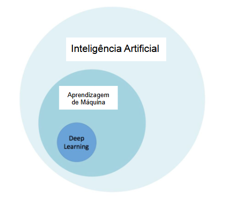
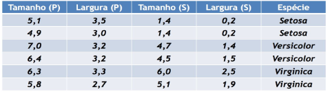
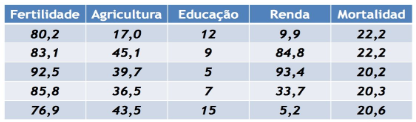
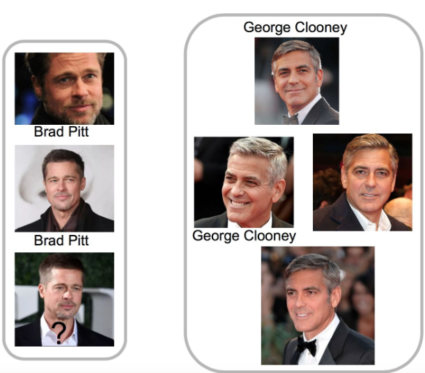

# Paradigmas de Aprendizagem de máquina

## Índices

- [Paradigmas de Aprendizagem de máquina](#paradigmas-de-aprendizagem-de-máquina)
  - [Índices](#índices)
  - [Sobre](#sobre)
  - [Aula 1: Introdução à IA](#aula-1-introdução-à-ia)
  - [Aula 2: Agentes Inteligentes](#aula-2-agentes-inteligentes)
  - [Aula 3: Aprendizagem de Máquina](#aula-3-aprendizagem-de-máquina)
    - [Aprendizagem supervisionada](#aprendizagem-supervisionada)
      - [Problema de Classsificação](#problema-de-classsificação)
      - [Problema de Regressão](#problema-de-regressão)
    - [Aprendizagem não supervisionada](#aprendizagem-não-supervisionada)
    - [Aprendizagem semi-supervisionada](#aprendizagem-semi-supervisionada)
    - [Aprendizagem por reforço](#aprendizagem-por-reforço)
  - [Aula 4: Pré-processamento de Dados. pt1](#aula-4-pré-processamento-de-dados-pt1)
    - [Objetos](#objetos)
    - [Atributos](#atributos)
    - [Conjunto de dados](#conjunto-de-dados)
    - [Etapas do pré processamento](#etapas-do-pré-processamento)
    - [Estatística descritiva](#estatística-descritiva)
      - [Variância](#variância)
      - [Desvio padrão](#desvio-padrão)
      - [Correlação](#correlação)
  - [Aula 5: Pré-processamento de Dados. pt2](#aula-5-pré-processamento-de-dados-pt2)
    - [Eliminação manual dos atributos](#eliminação-manual-dos-atributos)
    - [Integração de dados](#integração-de-dados)
    - [Amostragem de dados](#amostragem-de-dados)
    - [Balanceamento de dados](#balanceamento-de-dados)
    - [Limpeza de dados](#limpeza-de-dados)
    - [Redução de dimensionalidade](#redução-de-dimensionalidade)
    - [Transformação de dados](#transformação-de-dados)
  - [Aula 6: KNN](#aula-6-knn)
  - [Aula 7: Avaliação de Modelos Preditivos](#aula-7-avaliação-de-modelos-preditivos)
    - [Métricas para Classificação](#métricas-para-classificação)
    - [Métricas para Regressão](#métricas-para-regressão)

## Sobre

Este é um repositório com anotações das aulas do curso de Paradigmas de Aprendizagem de Máquina 2024.2 da UFPB.

## Aula 1: Introdução à IA

## Aula 2: Agentes Inteligentes

## Aula 3: Aprendizagem de Máquina

A aprendizagem de máquina pode ser definida como a construção de programas de computador que melhoram seu desempenho por meio de experiência, aprendem automaticamente a partir de **grandes volumes de dados** e geram hipóteses a partir dos dados.

Algumas definições para ajudar no entendimento:

**Inteligência Artificial:** "O estudo e projeto de agentes inteligentes", onde um agente inteligente é um sistema que percebe seu ambiente e toma atitudes que maximizam suas chances de sucesso. Também pode ser definida como o ramo da ciência da computação que se ocupa do comportamento inteligente ou ainda, o estudo de como fazer os computadores realizarem coisas que, atualmente, os humanos fazem melhor.

**Aprender:** Ganhar conhecimento através do estudo, experiência ou sendo ensinado

Exemplo:

- Melhorar a realização da tarefa T
- Em relação à medida de desempenho P
- Baseada na experiência E

### Aprendizagem supervisionada

Na aprendizagem supervisionada cada **instância** possui **atributos preditivos** e um **atributo alvo** rotulado pelo supervisor.

Na fase de treinamento, o modelo conhece o valor correto do atributo alvo onde, posteriormente, tentará prever o atributo de novas instâncias não rotuladas.

Temos dois tipos de problemas em aprendizagem supervisionada: [Problema de classificação](#problema-de-classsificação) e [problema de regressão](#problema-de-regressão).

#### Problema de Classsificação

O domínio é um conjunto de valores nominais ou valores discretos.

Exemplo:

_**Atributos preditivos:** Tamanho (P), Largura(P), Tamanho(S) e Laargura(S)_.

_**Atributo alvo:** Espécie_.

#### Problema de Regressão

O domínio é um conjunto infinito e ordenado de valores.

Exemplo:

_**Atributos preditivos:** Ferilidade, Agricultura, Educação e Renda_.

_**Atributo alvo:** Mortalidade_.

### Aprendizagem não supervisionada

Na aprendizagem não supervisionada o modelo só possui os atributos preditvos, não há atributo um alvo rotulado.

O objetivo do modelo é criar grupos generalizados e agrupar instâncias  semelhantes entre si nesses grupos diferenciando-as de outros grupos de instâncias semelhantes entre si.

### Aprendizagem semi-supervisionada

A linha de pensamento é:

- O modelo recebe instâncias com e sem o atributo alvo.

- O modelo executa o método não supervisionado.

- Uma vez gerado os grupos, haverá instâncias com atributo alvo rotulado dentro daquele grupo, dessa forma, o modelo acaba generalizando aquele grupo devido à essas instâncias rotuladas.

Exemplo:

No exemplo abaixo, é possível ver instâncias sem atributo alvo e com os atributos alvo **"Brad Pitt"** e **"George Clonney"**.

As instâncias estão separadas em 2 grupos gerados pelo método **não supervisionado**.

O método **semi-supervisionado** generaliza esses 2 grupos como "grupo Brad Pitt" e "grupo George Clooney" a partir das instâncias incluidas nesses grupos com o atributo alvo rotulado.

### Aprendizagem por reforço

O modelo recebe estados, ações, uma medida de desempenho realiza a associação estado ação tentando maximizar o desempenho.

Exemplo Chrome Dino:

O famoso jogo do navegador chrome quando o usuário perde a conexão com a internet.

Nesse jogo os podemos identificaar os estados como os frames, as ações pular e abaixar e a medida de desempenho a distância percorrida, quanto maior melhor.

## Aula 4: Pré-processamento de Dados. pt1

### Objetos

- Representam objetos físicos ou uma noção abstrata.
- Cada objeto corresponde a uma ocorrência dos dados.

### Atributos

- Cada objeto é descrito por um conjunto de atributos de entrada ou vetor de características.
- Cada atributo está associado a uma propriedade do objeto.

### Conjunto de dados

- Os dados podem ser representados por uma matriz de objetos $X$ $n$ $x$ $d$, em que $n$ é o número de objetos e $d$ é o número de atributos de entrada de cada objeto.
- o valor de $d$ define a dimensionalidade dos objetos ou do espaço dos objetos

### Etapas do pré processamento

- Eliminação manual dos atributos
- Integração de dados
- Amostragem de dados
- Balanceamento de dados
- Limpeza de dados
- Redução de dimensionalidade
- Transformação de dados

### Estatística descritiva

resume de forma quantitativa as principais características de um conjunto de dados.

#### Variância

Uma **Medida de dispersão** que mostraquão distante os valores estão da média.

**Covariância:** mede o grau em que os atributos crescem juntos.

#### Desvio padrão

É simplesmente o resultado positivo da raíz quadrada da variância. Na prática, o desvio padrão indica qual é o "erro" se quiséssemos substituir um dos valores coletados pelo valor da média.

#### Correlação

Indica o grau de associação entre duas variáveis. Ela mostra a direção e a força do relacionamento entre essas variáveis, podendo ser:

- **Positiva:** quando o aumento de uma variável está associado ao aumento da outra.
- **Negativa:** quando o aumento de uma variável está associado à diminuição da outra.
- **Nula:** quando não há associação entre as variáveis.

## Aula 5: Pré-processamento de Dados. pt2

### Eliminação manual dos atributos

### Integração de dados

- Busca atributos comuns nos conjuntos de dados a serem combinados;
- Atributos utilizados para combinação deve(m) ter um valor único para cada objeto.

### Amostragem de dados

### Balanceamento de dados

### Limpeza de dados

### Redução de dimensionalidade

### Transformação de dados

## Aula 6: KNN

## Aula 7: Avaliação de Modelos Preditivos

### Métricas para Classificação

### Métricas para Regressão
